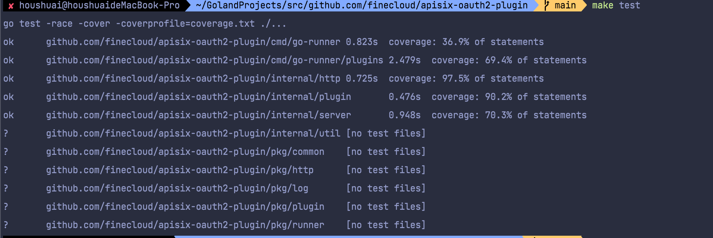

# Go Plugin

The documentation can be found in this [website](http://apisix.apache.org/docs/go-plugin-runner/getting-started), which
is generated from the files under `docs/`.

# Introduction

> Apisix plug-in to manage the content of custom rules.

- for make test

# Plan

- [x] [Support Spring oauth2](docs/cn/Oauth2-plugin.md) for apisix gateway